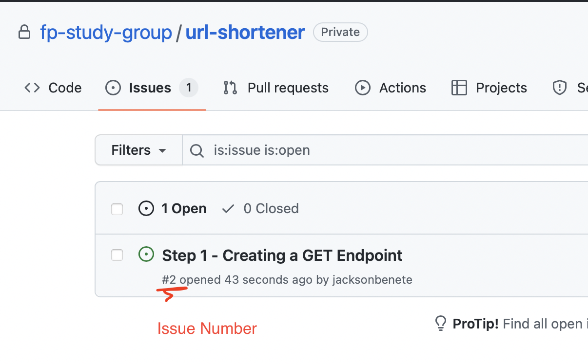
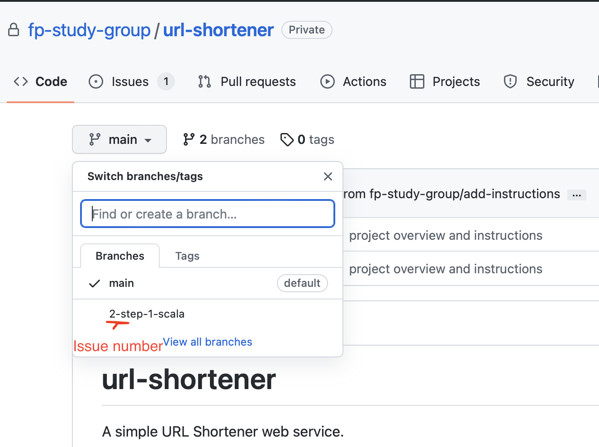

# url-shortener
A simple URL Shortener web service.

This project describes a simple web service.

### 1
We're going to implement the same project in various different 
programming languages and in various different stages.

Each stage will be described in an ISSUE, and once everything is implemented,
we're going to start the next stage and re-write or fix the problems described
by the new ISSUE.

Each member will create a new folder and implement it using his language of choice.

Everytime you have a problem or a question, create an issue.

### 2
Do not commit to the master branch, but create new branches for each new step
and open a pull-request.

Name the branch like this: `xx-step-y-mylanguage`.

Where `xx` is the Issue number of that step. 
- Example: `02-step-1-scala`

To know the issue number, go to the issue pages and look below the issue name:

See my own branch as an example:

Please create a Readme file in the folder of your implementation describing
how to run and how to use your application,
or provide a dockerfile or docker-compose to run.

### 3
Ultimately, we'll have a web service ready to be deployed in a real server
providing endpoints and persistence for shortening urls.

(I'll deploy it on my personal server for you to see it running)

By the end of this project you'll be familiar with using Git and GitHub as well.
